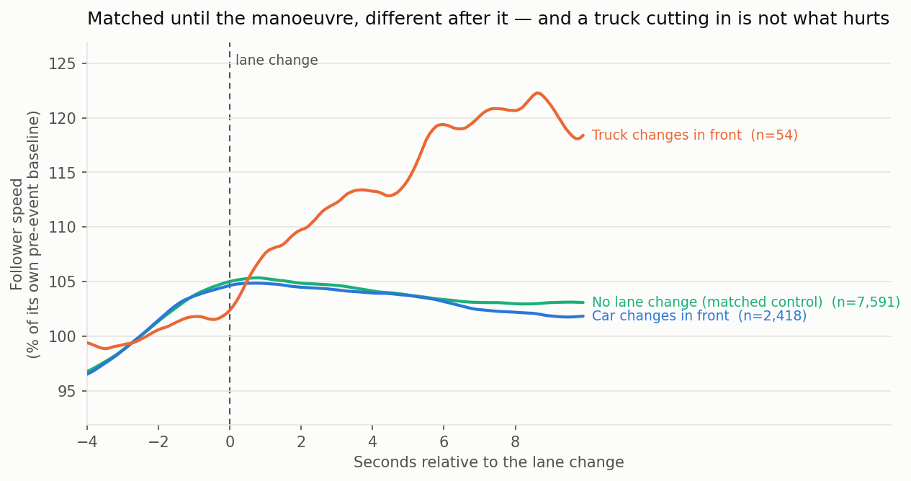
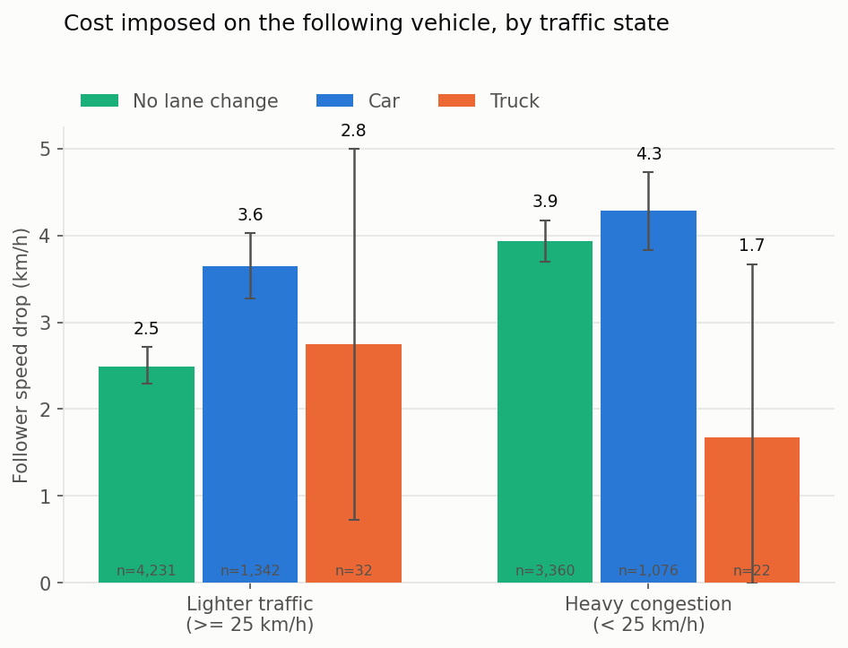

# The Externality of a Lane Change

[](https://github.com/wein2004/lane-change-externality/actions/workflows/tests.yml)

**How much does one lane change cost the traffic behind it — and does it matter
who makes it?**

A reproducible analysis of 8.7 million vehicle-trajectory records from the US
Federal Highway Administration's NGSIM programme, framed as a logistics
fleet-management question rather than a traffic-engineering one.



---

## Headline

We set out to show that heavy goods vehicles impose a larger cost on following
traffic than cars do. **The data rejected that hypothesis, in the opposite
direction.**

From 2,472 clean lane-change events, each compared against matched control
moments where no lane change occurred:

| Finding | Estimate (95% CI) |
|---|---|
| A lane change does cost the follower speed | **+0.76 km/h** (+0.44 .. +1.09) |
| …and delays its recovery | **+0.27 s** (+0.15 .. +0.40) |
| A **truck** cutting in costs **less** than a car | **−1.62 km/h** (−3.12 .. −0.02) |
| …and the follower recovers faster | **−0.98 s** (−1.60 .. −0.30) |
| Trucks also change lanes less often | 7.7 vs 10.7 per vehicle-hour |
| **But net time lost by the follower** | **+0.03 s (−0.25 .. +0.27) — not distinguishable from zero** |

The result that matters is what happens when you control for context. Once
traffic state, speed and headway are held constant, **the truck coefficient is
not distinguishable from zero** (p = 0.47). What survives is congestion: every
1 km/h slower the surrounding traffic, the identical manoeuvre costs the
follower **0.35 km/h more** (p < 0.001).

> **The externality is a property of the moment, not of the vehicle.**
> Two identical lane changes, one in free-flowing traffic and one in a jam, are
> not the same act. A fleet policy that targets vehicle classes is aiming at the
> wrong variable; one that targets *when* and *into what gap* a manoeuvre
> happens is aiming at the right one — and professional drivers in this data are
> already the ones doing it well.



## Why the measurement is defensible

The naive version of this analysis — "follower speed drops X km/h after a lane
change" — proves nothing. Congested traffic oscillates constantly, so a follower
would have slowed down at plenty of randomly chosen moments too.

Every real event is therefore compared against **matched control moments**:
vehicles that held their lane across the whole window, matched by
nearest-neighbour on how fast they were going, whether they were already
speeding up or slowing down, and how much room they had — all measured strictly
*before* the event.

The matching is checked, not assumed. In `fig1` above, the control and event
traces are indistinguishable until t = 0 and separate only afterwards.

And a validation from a column the estimator never sees:

| | mean gap before | mean gap at t = 0 | change |
|---|---|---|---|
| lane-change events | 106.3 ft | 63.7 ft | **−42.6 ft** |
| matched controls | 105.8 ft | 102.7 ft | −3.2 ft |

Event followers lose 42.6 ft of headway at the moment of the change; matched
controls lose 3.2 ft. The events really are cut-ins, and the controls really are
undisturbed.

## What went wrong along the way

`docs/decision-log.md` records every non-obvious choice, including four bugs
that each produced plausible-looking output:

| | Bug | How it surfaced |
|---|---|---|
| D5 | I-80's last two recordings are contiguous in wall-clock time, so a gap-based period split merged them and 88 vehicle IDs collided | an unrelated crash |
| D8 | The first control group was *accelerating* 23% over the window — matching on speed level alone selects vehicles emerging from a jam | plotting the control trace |
| D9 | 704,000 exact duplicate rows in the published US-101 table | an unrelated crash |
| D10 | Matching on the gap at t = 0 conditioned on a post-treatment variable and **flipped the sign of the headline result** | reasoning about the DAG |

Three of the four were invisible in the summary statistics.

## Reproducing it

```bash
pip install -r requirements.txt
bash scripts/run_all.sh
```

Or step by step:

```bash
python tests/test_detection.py        # 22 checks on synthetic trajectories
python scripts/01_download_ngsim.py   # ~10 min, 9.4M rows from the public API
python scripts/02_detect_events.py    # events + matched controls
python scripts/03_analyse.py          # bootstrap CIs, regression
python scripts/04_figures.py          # figures
```

No API key or login required. `data/raw/` is gitignored — step 1 rebuilds it.

## Layout

```
scripts/   numbered, run in order; each writes its own log
src/       shared constants, loaders, unit conversions
tests/     synthetic-trajectory checks on the detection logic
docs/      decision log, methodology, walkthrough — why, not just what
outputs/   figures, tables, results.json, run logs
```

| doc | what it is |
|---|---|
| `docs/decision-log.md` | every non-obvious choice, with the reasoning and the bugs |
| `docs/methodology.md` | the formal method, window by window |
| `docs/walkthrough.md` | plain-language tour of every script (Chinese) |
| `docs/qa-prep.md` | the 12 hardest questions and honest answers (Chinese) |

## Data

**Next Generation Simulation (NGSIM) Vehicle Trajectories**, US Department of
Transportation — vehicle positions recorded at 10 Hz from overhead video.

- Portal: <https://data.transportation.gov/d/8ect-6jqj>
- Sites used: **I-80** (Emeryville, CA) and **US-101** (Los Angeles, CA).
  The two arterial sites are excluded — see decision log D2.
- Licence: US Government public domain.

NGSIM's speed and acceleration channels are differentiated from video-extracted
positions and are known to contain noise and physically implausible values
(Punzo, Borzacchiello & Ciuffo, 2011). Speed is smoothed before use and
acceleration-based measures are avoided — see decision log D4.

## Limitations

Stated up front rather than buried:

1. **The disturbance is sharp, not sustained.** The dip in the follower's speed
   is real and significant in depth (+0.76 km/h) and in recovery time
   (+0.27 s), but the *net* time that follower loses over the following 10 s is
   +0.03 s with a confidence interval spanning zero. This analysis does **not**
   support a claim that one lane change costs the vehicle behind measurable
   travel time. Whether these perturbations amplify into stop-and-go waves
   upstream — the mechanism that would make them matter in aggregate — is a
   real question this dataset cannot answer: the observed sections are only
   500–640 m long and we track a single follower for 10 s.
2. **Small truck sample.** 54 truck events against 2,418 car events. The
   confidence intervals say so, and the truck result should be read as
   suggestive. It is reported because it contradicts our hypothesis, not
   because it is precise.
3. **Short observation windows.** I-80's section is ~500 m, US-101's ~640 m.
   Recovery times are right-censored at 10 s, so the reported figure is a
   lower bound.
4. **2005 US freeway data.** Vehicle mix, engine performance and driver
   behaviour differ from a 2026 Hong Kong context. The method transfers; the
   coefficients should be re-estimated on local telematics before anyone acts
   on them.
5. **Observational, not experimental.** Matching and regression remove the
   obvious confounders. They do not make this a randomised trial.

## Licence

Code: MIT. Data: US Government public domain, via the US DOT open data portal.
